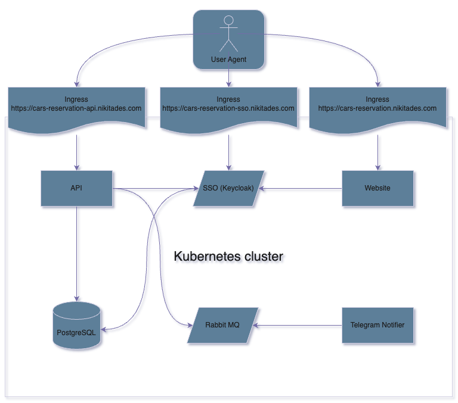

# [Cars Reservation System](https://cars-reservation.nikitades.com)

<p align="center">
  <a href="https://cars-reservation.nikitades.com">
    
  </a>
</p>


[](https://sonarcloud.io/summary/new_code?id=leathermen_carres_api) [](https://sonarcloud.io/summary/new_code?id=leathermen_carres_api) [](https://sonarcloud.io/summary/new_code?id=leathermen_carres_api)

</p>

### A test project to put together some knowledge I have about creating web apps with Spring (and also eventually Javascript and some DevOps practiques).

#### Website: [https://cars-reservation.nikitades.com](https://cars-reservation.nikitades.com)

#### My LinkedIn: [https://www.linkedin.com/in/nikita-pavlovskiy-6b3618127/](https://www.linkedin.com/in/nikita-pavlovskiy-6b3618127/)


*Promoted demo admin account (with the access to the Dashboard):*
```
login: example@nikitades.com
password: example15
```

**Please, log in with Github or Google or register yourself with registration form.**


## Applications and parts

<table>
  <tr>
    <td width="60%">
      <ul>
        <li>Spring Boot API (<a href="apps/backend/api/README.md">readme</a>)</li>
        <li>Spring Boot Telegram Notifier (<a href="apps/backend/tg-notifier/README.md">readme</a>)</li>
        <li>React (Next.js) frontend app (<a href="apps/website/README.md">readme</a>)</li>
        <li>Keycloak SSO server (<a href="apps/keycloak/README.md">readme</a>)</li>
        <li>CloudFlare reverse proxying (<a href="REVERSE-PROXYING.md">readme</a>)</li>
      </ul>
    </td>
    <td>
      
    <td>
  </tr>
</table>

## Diagram

Services are located in the K8S cluster and exposed over Traefik ingresses.

<p align="center">
  
</p>

## Ideas

This whole project is supposed to visualize the idea of a great web application. The API is covered with tests thoroughly, both in unit and integration style. The domain area of the app is rather simple, so it takes no Ubiquitous Language to describe. Also, DDD techniques were intentionally not used to speed up the development and also out of lack of reason to use ones: the project is small, as I already said.

## Visual metrics and materials

- [API Swagger UI](https://cars-reservation-api.nikitades.com/open/swagger-ui)
- [**Public Sonarcloud report**](https://sonarcloud.io/summary/new_code?id=leathermen_carres_api) (the coverage included)
- [Grafana dashboards (examples)](MONITORING.md)

## General technical specification

The project is hosted at Hetzner (ARM), using Kubernetes setup.
The Continuous Integration is done using GitHub actions.

DDOS mitigation is achieved by hiding the real IP address of the cluster entrypoints, by reverse proxying all the requests through CloudFlare system. It's known for being able to withstand attacks of a solid density.

Github Actions is used as CI/CD platform. An extensive set prefabricated actions helps a lot.

Please see more in root folders of every particular application.

## Technologies used

- Spring Boot (main API & Telegram notifier)
- Next.js (SSR website)
- Keycloak (SSO service)
- Rabbit MQ (AMQP bus)
- Kubernetes (orchestration)
- Prometheus (metrics scraping)p
- Grafana (metrics visualization)
- CloudFlare (reverse proxying and DDOS mitigation)
- SonarCloud (code quality gate)

## Metrics & observability

Prometheus is responsible for scraping metrics from services. The observed services:

- Spring Boot API
- Next.js website
- Rabbit MQ
- Kubernetes cluster itself

Typically metrics endpoints are protected with OAuth2 security. Only users of "Cars Reservation" realm with role "metrics-scraper" are allowed to the metrics data. Prometheus is capable of obtaining the JWT agains the SSO service on its own.

## Local launch

This project is supposed to be launched locally with Minikube or any other sort of local K8S cluster.
You will need [Minikube](https://minikube.sigs.k8s.io/docs/start/) or similar technology to achieve this.

See more at ["Launching locally"](.k8s/local/README.md).

## Credits

The author: Nikita Pavlovskiy, [nikitades@pm.me](nikitades@pm.me).

Contact me in Telegram: [@nikitades](https://t.me/nikitades).
